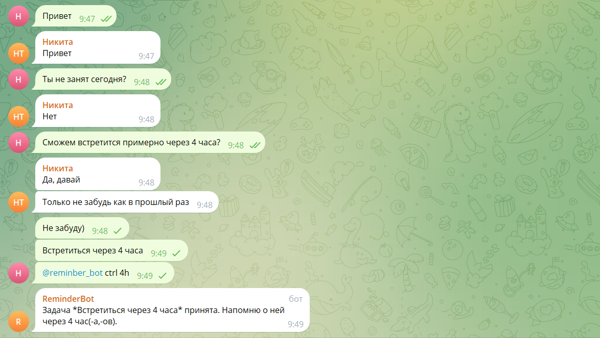

# Telegram Reminder Bot

## Описание проекта

Telegram Reminder Bot - это бот для Telegram, который позволяет пользователям устанавливать напоминания о задачах. Пользователи могут отправить команду боту в формате `@bot_name ctrl 5d`, где `5d` указывает срок напоминания (N - интервал, M - продолжительность: h - час, d - день, w - неделя, m - месяц). Бот принимает задачу и отправляет напоминание через указанный интервал.

## Технологии

- Python
- python-telegram-bot
- APScheduler
- python-dotenv

## Инструкция по сборке проекта

### Шаг 1: Клонирование репозитория

```bash
git clone https://github.com/Thorch3n/telegram_reminder_bot
cd telegram_reminder_bot
```

### Шаг 2: Создание виртуального окружения
```bash
python -m venv venv
source venv/bin/activate  # Для Windows используйте `venv\Scripts\activate`
```

### Шаг 3: Установка зависимостей
```bash
pip install -r requirements.txt
```

### Шаг 4: Создание бота
Создайте своего бота в Telegram через @BotFather


### Шаг 5: Настройка переменных окружения
Измените файл .env.template на .env и внесите туда токен своего бота, который вы получили после его создания
```bash
TELEGRAM_BOT_TOKEN=your_telegram_bot_token_here
```

### Шаг 5: Запуск бота
```bash
python main.py
```

# Использование
- Отправьте сообщение боту или в чат, где бот добавлен, чтобы сохранить последнее сообщение.
- Используйте команду @bot_name ctrl NM, чтобы установить напоминание (где N - интервал, M - единица времени: h - час, d - день, w - неделя, m - месяц).

# Пример
1. Сохраните сообщение:

   - Пользователь: "Купить молоко"
   - Бот: "Сообщение сохранено. Используйте @bot_name ctrl NM для создания напоминания."
2. Установите напоминание:

   - Пользователь: @bot_name ctrl 5d
   - Бот: "Задача *Купить молоко* принята. Напомню о ней через 5 час(-a,-ов)."   

# Скриншот примера
